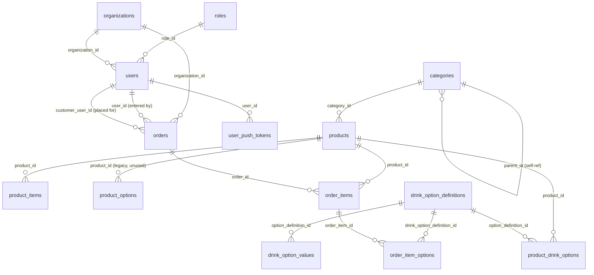

# Database: local copy & schema reference

Two things live here:

1. **How to pull a copy of the production database down for local testing.**
2. **A full reference of every table** — kept in sync by hand with
   [`scripts/schema.sql`](../scripts/schema.sql) and the `migration_*.sql`
   files. If you add a migration, update this file in the same commit.

## 1. Getting a local copy of the production database

The VPS's MySQL only listens on `127.0.0.1` (never exposed publicly), so you
always go through SSH.

### If you SSH in as `root` (this project's actual day-to-day access)

Ubuntu/Debian's MySQL defaults `root@localhost` to the `auth_socket` plugin —
connecting as the OS user `root` over the local unix socket authenticates you
as MySQL `root` with **no password at all**. Since the `mysqldump` below runs
*on the server itself* (piped back to you over SSH), it hits that local
socket, so no password handling is needed anywhere in this command:

```bash
ssh root@YOUR_SERVER_IP \
  "mysqldump -u root --single-transaction --no-tablespaces church_cafe_db" \
  > db-dumps/cafe_$(date +%Y%m%d).sql
```

If that comes back with `Access denied for user 'root'@'localhost'`, this
server's root MySQL account has a real password set instead of
`auth_socket` — add `-p` (prompts interactively) to the remote command.

`--single-transaction` gets a consistent snapshot without locking tables.
`--no-tablespaces` isn't strictly required for `root` (it has the `PROCESS`
privilege tablespace metadata needs) but is harmless to leave in.

### If you SSH in as the restricted `deploy` user instead

Some environments use a locked-down `deploy` SSH user and a non-root
`church_cafe` MySQL account (see `DEPLOY.md`). The same idea, but you must
supply `church_cafe`'s password (the `DB_PASSWORD` value in
`/var/www/church-cafe-backend/shared/.env` — SSH in and `cat` that file once
to read it) and `--no-tablespaces` becomes mandatory (MySQL 8+ tablespace
metadata needs the `PROCESS` privilege, which this user doesn't have):

```bash
ssh deploy@YOUR_SERVER_IP \
  "mysqldump -u church_cafe -p'DB_PASSWORD_HERE' --single-transaction --no-tablespaces church_cafe_db" \
  > db-dumps/cafe_$(date +%Y%m%d).sql
```

Don't want the password sitting in your local shell history in plaintext?
SSH in interactively first, dump to a temp file, `scp` it down, then delete it
from the server:

```bash
ssh deploy@YOUR_SERVER_IP   # or root@YOUR_SERVER_IP
#  — on the server —
mysqldump -u church_cafe -p --single-transaction --no-tablespaces church_cafe_db > /tmp/cafe_dump.sql
exit
#  — back on your machine —
scp deploy@YOUR_SERVER_IP:/tmp/cafe_dump.sql db-dumps/cafe_$(date +%Y%m%d).sql
ssh deploy@YOUR_SERVER_IP "rm /tmp/cafe_dump.sql"
```

(The classic way this goes wrong: skip the `mysqldump` line, or have it fail
silently because the password was wrong — then the `scp` fails with
`No such file or directory` because nothing was ever written to `/tmp` on the
server. Run `ssh … "ls -la /tmp/*.sql"` to confirm the dump actually exists
there before trying to fetch it.)

Either way, save the dump under `db-dumps/` in this repo — that folder is
git-ignored so a multi-hundred-MB file (with real customer emails, password
hashes and card codes in it) never gets committed.

### Option B — also grab the uploaded images

Product/user photos live on disk, not in MySQL, so a DB dump alone leaves
image `` tags 404ing locally:

```bash
rsync -av root@YOUR_SERVER_IP:/var/www/church-cafe-backend/shared/uploads/ uploads/
```

### Load the dump into your local MySQL

```bash
mysql -u root -p -e "CREATE DATABASE IF NOT EXISTS church_cafe_db CHARACTER SET utf8mb4 COLLATE utf8mb4_unicode_ci;"
mysql -u root -p church_cafe_db < db-dumps/cafe_YYYYMMDD.sql
```

Then point `my-church-cafe-backend/.env` at it (this is already the
`env.example` default):

```
DB_HOST=localhost
DB_PORT=3306
DB_USER=root
DB_PASSWORD=yourlocalpassword
DB_NAME=church_cafe_db
```

Start the backend as usual (`npm run dev`) — since the dump already has every
column production has, there's no migration step and nothing for
`src/utils/columns.js`'s per-process cache to get stale about.

**Heads-up for testing:** the dump contains real users (with real password
hashes — nobody's plaintext password, but still don't treat it as throwaway
data), real card codes, and whatever orders were live. If you're testing
destructive flows (deleting orders/users, resetting card codes, wiping
`order_item_options`), do it against this local copy only — never against the
dump file itself, so you can reload a clean copy by re-running the `mysql …
< db-dumps/…` step.

### Re-syncing later

Nothing here is idempotent-safe against a half-migrated local DB — if your
local schema has since drifted (you ran a migration locally that prod hasn't
seen yet, or vice versa), drop and recreate the local database before
reloading:

```bash
mysql -u root -p -e "DROP DATABASE church_cafe_db; CREATE DATABASE church_cafe_db CHARACTER SET utf8mb4 COLLATE utf8mb4_unicode_ci;"
mysql -u root -p church_cafe_db < db-dumps/cafe_YYYYMMDD.sql
```

---

## 2. Schema overview



`app_settings` is a standalone key/value table with no foreign keys (one row
per setting, e.g. `menu_note`).

## 3. Table reference

### `roles`

| Column | Type | Notes |
| --- | --- | --- |
| `id` | `INT PK AUTO_INCREMENT` | |
| `name` | `VARCHAR(50) UNIQUE` | `admin`, `personal`, `parishioner` — seeded by `schema.sql` |
| `description` | `VARCHAR(255)` | |

### `organizations`

Added by `migration_organizations.sql`. Light multi-tenancy; a `'Default'` row
is always seeded.

| Column | Type | Notes |
| --- | --- | --- |
| `id` | `INT PK AUTO_INCREMENT` | |
| `name` | `VARCHAR(150) UNIQUE` | |
| `created_at` | `DATETIME` | |

### `users`

| Column | Type | Notes |
| --- | --- | --- |
| `id` | `INT PK AUTO_INCREMENT` | |
| `name` | `VARCHAR(100)` | |
| `email` | `VARCHAR(120) UNIQUE` | |
| `password_hash` | `VARCHAR(255)` | bcrypt |
| `picture_url` | `VARCHAR(512) NULL` | added by `migration_user_picture.sql` |
| `role_id` | `INT` → `roles.id`, `ON DELETE SET NULL` | |
| `organization_id` | `INT NULL` → `organizations.id`, `ON DELETE SET NULL` | added by `migration_organizations.sql` |
| `card_code` | `VARCHAR(32) NULL UNIQUE` | added by `migration_customer_card.sql`; lazily issued on first `GET /api/card`, QR payload is `cc:card:<code>` |
| `created_at` | `DATETIME` | |

### `categories`

Self-referential two-level hierarchy. Top-level rows have `parent_id IS NULL`
(`Drink`, `Meal`, `Dessert`, `Other`); drink subtypes (`Coffee`,
`Season drinks`, `Other drinks`) are children of the `Drink` row.

| Column | Type | Notes |
| --- | --- | --- |
| `id` | `INT PK AUTO_INCREMENT` | |
| `name` | `VARCHAR(50)` | |
| `parent_id` | `INT NULL` → `categories.id`, `ON DELETE SET NULL` | `NULL` = top-level |

### `products`

| Column | Type | Notes |
| --- | --- | --- |
| `id` | `INT PK AUTO_INCREMENT` | |
| `category_id` | `INT` → `categories.id`, `ON DELETE SET NULL` | |
| `name` | `VARCHAR(100)` | canonical English name, never translated |
| `name_lt` | `VARCHAR(100) NULL` | added by `migration_product_translations.sql` |
| `name_ru` | `VARCHAR(100) NULL` | added by `migration_product_translations.sql` |
| `description` | `TEXT` | |
| `base_price` | `DECIMAL(10,2)` | |
| `image_url` | `VARCHAR(255)` | served from `uploads/products/` |
| `available` | `BOOLEAN DEFAULT TRUE` | |
| `available_until` | `DATETIME NULL` | added by `migration_product_available_until.sql`; backend auto-flips back to `available` after this passes |
| `sort_order` | `INT DEFAULT 0` | added by `migration_product_sort_order.sql`; one running sequence across every product, reordered via `PUT /api/products/reorder` |

### `product_items`

Per-product SKU/variant rows (e.g. sizes). Still actively used by
`src/routes/products.js` and `orders.js`.

| Column | Type | Notes |
| --- | --- | --- |
| `id` | `INT PK AUTO_INCREMENT` | |
| `product_id` | `INT` → `products.id`, `ON DELETE CASCADE` | |
| `name` | `VARCHAR(100)` | |
| `sku` | `VARCHAR(50)` | |
| `price` | `DECIMAL(10,2)` | |
| `available` | `BOOLEAN DEFAULT TRUE` | |

### `product_options` — legacy, unused

Created by `schema.sql` as an older flat per-product options table. Nothing in
`src/` reads or writes it any more — superseded by `drink_option_definitions` /
`drink_option_values` / `product_drink_options` below. Left in place rather
than dropped since dropping it needs no code change but isn't risk-free on a
live DB either.

| Column | Type | Notes |
| --- | --- | --- |
| `id` | `INT PK AUTO_INCREMENT` | |
| `product_id` | `INT` → `products.id`, `ON DELETE CASCADE` | |
| `name` | `VARCHAR(50)` | |
| `value` | `VARCHAR(50)` | |
| `extra_price` | `DECIMAL(10,2) DEFAULT 0` | |

### `drink_option_definitions`

Admin-authored reusable options (e.g. "Sugar level", "Milk", "Take away").
Added by `migration_drink_options_tables.sql`.

| Column | Type | Notes |
| --- | --- | --- |
| `id` | `INT PK AUTO_INCREMENT` | |
| `name` | `VARCHAR(100)` | |
| `option_key` | `VARCHAR(64) UNIQUE` | |
| `type` | `ENUM('checkbox','select') DEFAULT 'select'` | |
| `checkbox_extra_price` | `DECIMAL(10,2) DEFAULT 0` | |
| `checkbox_default` | `TINYINT(1) DEFAULT 0` | added by `migration_option_defaults.sql`; whether a checkbox opens ticked |
| `sort_order` | `INT DEFAULT 0` | |
| `created_at` | `DATETIME` | |

### `drink_option_values`

Picklist/radio choices for a `select`-type definition.

| Column | Type | Notes |
| --- | --- | --- |
| `id` | `INT PK AUTO_INCREMENT` | |
| `option_definition_id` | `INT` → `drink_option_definitions.id`, `ON DELETE CASCADE` | |
| `label` | `VARCHAR(100)` | matched case/whitespace-insensitively when pricing an order line |
| `extra_price` | `DECIMAL(10,2) DEFAULT 0` | |
| `sort_order` | `INT DEFAULT 0` | |
| `is_default` | `TINYINT(1) DEFAULT 0` | added by `migration_option_defaults.sql`; at most one `1` per definition |

### `product_drink_options`

Join table: which products expose which option definitions.

| Column | Type | Notes |
| --- | --- | --- |
| `id` | `INT PK AUTO_INCREMENT` | |
| `product_id` | `INT` → `products.id`, `ON DELETE CASCADE` | |
| `option_definition_id` | `INT` → `drink_option_definitions.id`, `ON DELETE CASCADE` | |
| `sort_order` | `INT DEFAULT 0` | |
| | `UNIQUE (product_id, option_definition_id)` | |

### `orders`

| Column | Type | Notes |
| --- | --- | --- |
| `id` | `INT PK AUTO_INCREMENT` | |
| `user_id` | `INT` → `users.id`, `ON DELETE SET NULL` | who **entered** the order (the barista) |
| `customer_user_id` | `INT NULL` → `users.id`, `ON DELETE SET NULL` | who the order is **for**; added by `migration_customer_card.sql` |
| `organization_id` | `INT NULL` → `organizations.id`, `ON DELETE SET NULL` | added by `migration_organizations.sql` |
| `total` | `DECIMAL(10,2)` | |
| `status` | `ENUM('pending','preparing','ready','paid','cancelled','completed') DEFAULT 'pending'` | `'preparing'` is no longer assigned to new orders (`migration_drop_preparing_status.sql`) but stays in the enum for historical rows |
| `comment` | `TEXT NULL` | added by `migration_order_comments.sql` |
| `customer_name` | `VARCHAR(100) NULL` | added by `migration_order_customer_name.sql`; typed walk-up name when there's no `customer_user_id` |
| `created_at` | `DATETIME` | |

### `order_items`

| Column | Type | Notes |
| --- | --- | --- |
| `id` | `INT PK AUTO_INCREMENT` | |
| `order_id` | `INT` → `orders.id`, `ON DELETE CASCADE` | |
| `product_id` | `INT` → `products.id`, `ON DELETE SET NULL` | **renamed from `product_item_id`**; `src/routes/orders.js` detects which name exists at runtime via `SHOW COLUMNS` (see §4) |
| `quantity` | `INT DEFAULT 1` | |
| `price` | `DECIMAL(10,2)` | unit price **including** that line's option surcharges |
| `comment` | `TEXT NULL` | added by `migration_order_comments.sql` |

### `order_item_options`

Snapshots the options selected on one order line, for barista display and
receipts. Added by `migration_order_item_options.sql`.

| Column | Type | Notes |
| --- | --- | --- |
| `id` | `INT PK AUTO_INCREMENT` | |
| `order_item_id` | `INT` → `order_items.id`, `ON DELETE CASCADE` | |
| `drink_option_definition_id` | `INT NULL` → `drink_option_definitions.id`, `ON DELETE SET NULL` | |
| `option_definition_name` | `VARCHAR(100)` | label snapshot, not a live join |
| `option_value_name` | `VARCHAR(100)` | label snapshot |
| `extra_price` | `DECIMAL(10,2) DEFAULT 0` | added by `migration_order_item_option_price.sql`; snapshots what was actually charged so a later price change never rewrites past orders |

### `app_settings`

Free-form key/value store. Added by `migration_app_settings.sql`. Currently
one key in use: `menu_note`.

| Column | Type | Notes |
| --- | --- | --- |
| `setting_key` | `VARCHAR(64) PK` | |
| `setting_value` | `TEXT NULL` | |
| `updated_at` | `TIMESTAMP` | |

### `user_push_tokens`

One row per device that has granted notification permission. Added by
`migration_push_tokens.sql`.

| Column | Type | Notes |
| --- | --- | --- |
| `id` | `INT PK AUTO_INCREMENT` | |
| `user_id` | `INT` → `users.id`, `ON DELETE CASCADE` | |
| `token` | `VARCHAR(255) UNIQUE` | unique on the token itself (not per-user) — a device's token moves to whichever account is signed in |
| `platform` | `ENUM('ios','android')` | |
| `language` | `VARCHAR(8) DEFAULT 'en'` | app language on that device when registered; the server writes push text in this language |
| `updated_at` | `TIMESTAMP` | |

## 4. Columns detected at runtime, not assumed

The backend redeploys automatically on every push to `prod`, while migrations
are run by hand — so code routinely ships before its migration does.
`src/utils/columns.js` (`hasColumn`, cached per process via `SHOW COLUMNS`)
lets routes fall back gracefully instead of erroring for that window:

| Table.column | Checked in | Behaviour before the migration runs |
| --- | --- | --- |
| `order_items.product_id` (vs. legacy `product_item_id`) | `src/routes/orders.js` | uses whichever name exists |
| `order_item_options.extra_price` | `src/routes/orders.js` | option surcharges aren't added to the total |
| `products.sort_order` | `src/routes/products.js` | falls back to `name ASC`; `PUT /api/products/reorder` answers `503` |
| `products.name_lt` | `src/routes/products.js` | translated names aren't returned |
| `drink_option_values.is_default` / `drink_option_definitions.checkbox_default` | `src/routes/drinkOptions.js`, `src/utils/drinkOptionsForProducts.js` | options open on the first choice / unticked |
| `users.card_code` / `orders.customer_user_id` | `src/lib/customerCard.js` | `/api/card` answers `503`, orders take as before |
| `app_settings` (table existence) | `src/routes/settings.js` | `GET /api/settings/menu-note` answers `""`, `PUT` answers `503` |

**Restart the backend process after running any migration** — the cache above
is never invalidated in-process.

## 5. Migration order

Run in this exact order against a fresh `schema.sql` load (see the root
[`CLAUDE.md`](../../CLAUDE.md#database-setup) and
[`DEPLOY.md`](../DEPLOY.md#database) for the authoritative list). A dump taken
from a running production database (§1 above) already has every column these
migrations add, so none of them need to be run again after loading a dump.
